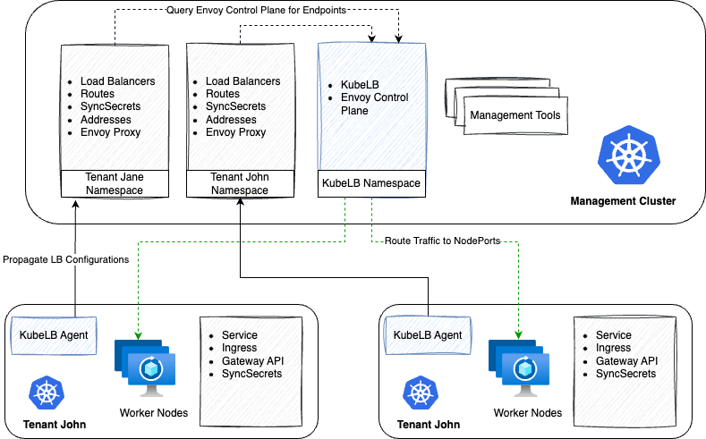

  
  

# KubeLB

## Overview

KubeLB is a project by Kubermatic, it is a Kubernetes native tool, responsible for centrally managing Layer 4 and 7 load balancing configurations for Kubernetes clusters across multi-cloud and on-premise environments.

### Motivation and Background

Kubernetes does not offer any implementation for load balancers and in turn relies on the in-tree or out-of-tree cloud provider implementations to take care of provisioning and managing load balancers. This means that if you are not running on a supported cloud provider, your services of type `LoadBalancer` will never be allotted a load balancer IP address. This is an obstacle for bare-metal Kubernetes environments.

There are solutions available like [MetalLB][2], [Cilium][3], etc. that solve this issue. However, these solutions are focused on a single cluster where you have to deploy the application in the same cluster where you want the load balancers. This is not ideal for multi-cluster environments since you have to configure load balancing for each cluster separately, which makes IP address management not trivial.

For application load balancing, we have the same case where an external application like [nginx-ingress][4], [envoy gateway][5], needs to be deployed in the cluster. To further secure traffic, additional tools are required for managing DNS, TLS certificates, Web Application Firewall, etc.

KubeLB solves this problem by providing a centralized management solution that can manage the data plane for multiple Kubernetes clusters across multi-cloud and on-premise environments. This enables you to manage fleet of Kubernetes clusters in a centralized way, ensuring security compliance, enforcing policies, and providing a consistent experience for developers.

## Architecture

KubeLB follows the **hub and spoke** model in which the "Management Cluster" acts as the hub and the "Tenant Clusters" act as the spokes. The information flow is from the tenant clusters to the management cluster. The agent running in the tenant cluster watches for nodes, services, ingresses, and Gateway API etc. resources and then propagates the configuration to the management cluster. The management cluster then deploys the load balancer and configures it according to the desired specification. Management cluster then uses Envoy Proxy to route traffic to the appropriate endpoints i.e. the node ports open on the nodes of the tenant cluster.

For security and isolation, the tenants have no access to any native kubernetes resources in the management cluster. The tenants can only interact with the management cluster via the KubeLB CRDs. This ensures that they are not exceeding their access level and only perform controlled operations in the management cluster.

## Documentation

For detailed documentation [KubeLB Docs][8].

## Installation

### Manager

Please refer to the [KubeLB Manager README](./charts/kubelb-manager/README.md) for installation instructions.

### CCM

Please refer to the [KubeLB CCM README](./charts/kubelb-ccm/README.md) for installation instructions.

## Troubleshooting

If you encounter issues [file an issue][1] or talk to us on the [#kubermatic channel][6] on the [Kubermatic Slack][7].

## Contributing

Thanks for taking the time to join our community and start contributing!

Feedback and discussion are available on [the mailing list][5].

### Before you start

- Please familiarize yourself with the [Code of Conduct][4] before contributing.
- See [CONTRIBUTING.md][2] for instructions on the developer certificate of origin that we require.

### Pull requests

- We welcome pull requests. Feel free to dig through the [issues][1] and jump in.

## Changelog

See [the list of releases][3] to find out about feature changes.

[1]: https://github.com/kubermatic/kubelb/issues
[2]: https://metallb.universe.tf
[3]: https://cilium.io/use-cases/load-balancer/
[4]: https://kubernetes.github.io/ingress-nginx/
[5]: https://gateway.envoyproxy.io/
[6]: https://kubermatic.slack.com/messages/kubermatic
[7]: http://slack.kubermatic.io/
[8]: https://docs.kubermatic.com/kubelb
